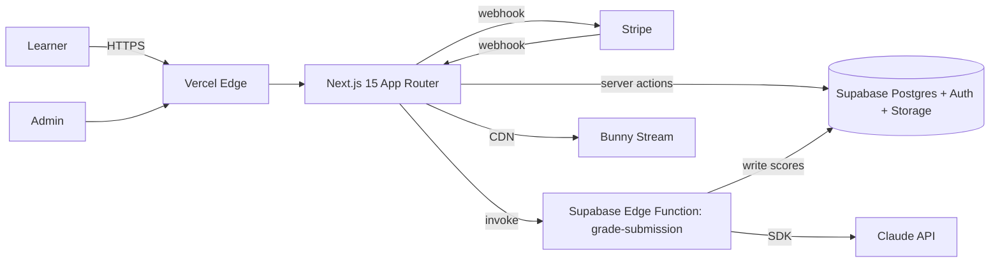
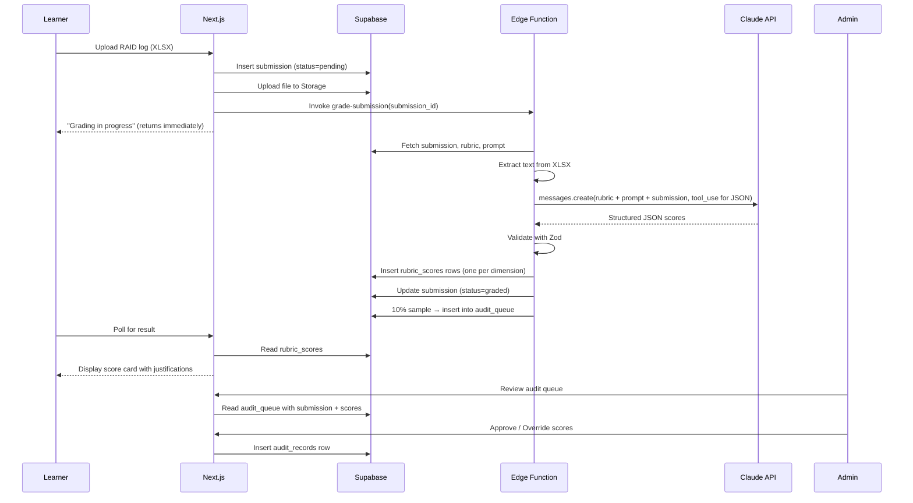
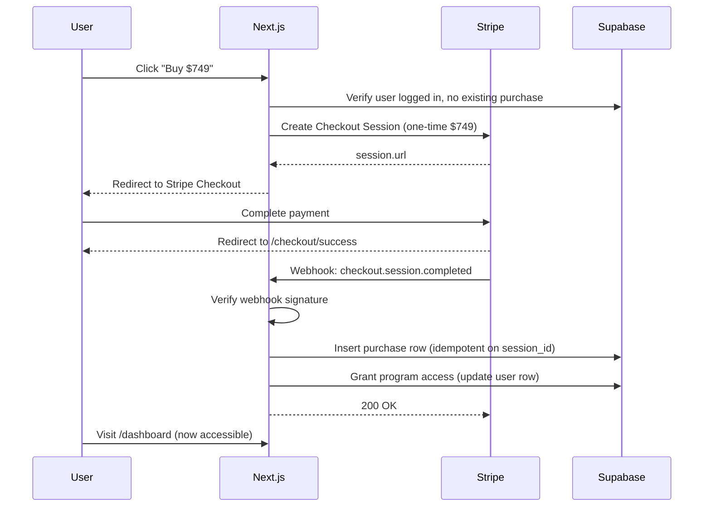
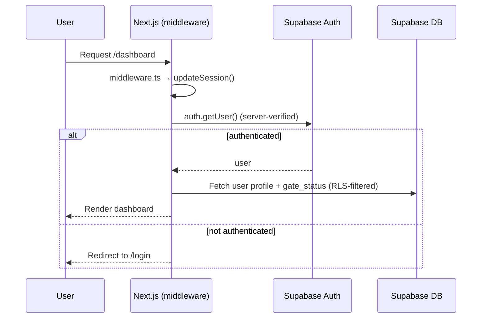

# Project Coordinator Launchpad — Claude Code Build Plan

**Audience:** solo founder + Claude Code as implementation vendor
**Scope:** MVP thin vertical slice — Lesson 20 (RAID Logs) end to end with auth, checkout, AI grading, and audit queue
**Stack:** Next.js 15 (App Router) + TypeScript + Supabase + Claude API + Stripe + Vercel
**Timeline:** 8–12 weeks at 30–40 Claude Code sessions per week
**Source of truth:** the Master Implementation Document (prior deliverable) defines product requirements; this document defines build execution

---

## 1. Executive brief for the build

**What you are building in this engagement.** A production Next.js web app that takes a user from landing page → signup → $749 Stripe checkout → learner dashboard → one complete lesson (video, workbook, quiz, graded artifact submission) → AI-graded feedback with rubric score display → admin audit queue for 10% human review. Everything smaller than the full 46-lesson program, and everything necessary to prove that the AI grading pipeline works on real infrastructure.

**What you are explicitly NOT building yet.** The remaining 45 lessons, mock interview panels, day-in-the-life simulations, tool sandboxes, outcomes dashboard, cohort management, multi-industry tracks, or community features. These are separate engagements against the same repo after the MVP is validated.

**Why this scope.** The grading pipeline is the product's moat and its single biggest technical risk. Everything else in the Master Implementation Document is execution on a solved pattern (video playback, quiz scoring, dashboards). Until one full lesson's grading loop works end to end — submit → parse → grade → validate → display → audit — building the other 45 is premature. Ship one lesson hardened, then mass-produce the rest against a locked template.

**Definition of done for the engagement.** A user on production can sign up, pay $749 through Stripe, complete Lesson 20 (watch the video, download the workbook template, pass the 10-item quiz, upload a RAID log artifact), receive an AI-graded rubric score with per-dimension justifications and direct quotes from their submission, see the submission in a history view, and be flagged into an admin audit queue if selected by the 10% sampler. All flows have E2E tests. The grading prompt is versioned, the audit log is append-only, and the CLAUDE.md file documents the repo well enough that a new Claude Code session can navigate it without prior context.

**Budget for Claude Code + external costs.** Roughly 240–400 Claude Code sessions over 8–12 weeks. External spend during build: Supabase Pro ($25/mo), Vercel Pro ($20/mo), Bunny Stream (~$10/mo during build), Anthropic API (~$50/mo during dev + calibration), Stripe (free until first transaction), domain and email (~$30/mo). Total infrastructure during build: roughly $135/month. One-time external costs (calibration panel, legal, design) are tracked in the Master Implementation Document and are outside the Claude Code engagement.

**What ships at the end.** A git repo on GitHub with main branch deployed to `launchpad.app` (or your chosen domain) on Vercel, a Supabase project with all migrations applied and RLS enforced, a passing CI pipeline, a grading pipeline that survives a 50-answer calibration corpus, and a CLAUDE.md that makes the next 45 lessons a templated content problem rather than a build problem.

---

## 2. Working agreement with Claude Code

This is the process the solo founder and Claude Code follow for every ticket. Deviations are allowed only with a written note in the PR description.

### 2.1 Core loop

```
Read ticket → Plan mode → Write failing test → Write implementation →
All tests green → Typecheck clean → Lint clean → Manual verify →
Update CLAUDE.md if needed → Commit → Open PR → Review → Merge
```

Claude Code's creator has publicly stated that unguided sessions succeed about 33% of the time and that the delta comes from the structure around the tool, not the prompts typed into it. The rest of this section is that structure, adapted from [Anthropic's official Claude Code best practices](https://code.claude.com/docs/en/best-practices).

### 2.2 Ticket scoping rules

- **One ticket = one PR = one coherent change.** No multi-feature tickets. If a ticket touches more than about 10 files or takes more than about 90 minutes of Claude Code wall-time, split it.
- **Every ticket has explicit dependencies.** A ticket cannot start until all dependency tickets are merged to main.
- **Every ticket has a "questions to resolve before starting" section.** If Claude Code hits an unanswered question during execution, it stops and asks rather than guessing.
- **Every ticket has a test requirement.** No code merges without the tests specified in its DoD.

### 2.3 Branching and git

- One branch per ticket, named `tkt/<ID>-<kebab-slug>` (e.g., `tkt/GRADE-005-anthropic-grading-service`).
- Commit early and often — Claude Code is instructed in CLAUDE.md to commit after each passing test or logical step, never at the end of a long session.
- PR title is the ticket ID and title; PR body links back to the ticket and lists the acceptance criteria as a checklist.
- Squash-merge on approval. Main stays linear.
- Never force-push to a branch after a PR is opened.

### 2.4 Definition of done (applies to every ticket)

A ticket is not done until all of the following are true:

1. All acceptance criteria in the ticket are checked off.
2. All tests specified in the ticket pass locally (`pnpm test`) and in CI.
3. Typecheck is clean (`pnpm typecheck`).
4. Lint is clean (`pnpm lint`).
5. The change has been manually verified by the human founder on a preview deploy.
6. If the ticket introduced a new pattern (new service, new hook, new component category), CLAUDE.md is updated.
7. If the ticket changed the data model, the migration is applied to the preview database and a note is added to the ADR log.
8. The commit messages read like a history, not a stream of consciousness.

### 2.5 Context management

Claude Code's context window degrades as it fills. Rules the founder follows:

- **`/clear` between unrelated tickets.** Never keep working on ticket GRADE-005 in the same session that just finished AUTH-003.
- **`/compact` inside a single ticket if the session stretches past 90 minutes or the context starts feeling fuzzy.** `/compact` preserves the working memory but drops chat history.
- **Plan mode (`/plan` or the built-in planning capability) for any ticket above "short" estimated length.** Force Claude Code to propose the plan, correct it, then execute.
- **Start complex tickets with `think hard`** (or `ultrathink` for architectural decisions). Extended thinking materially improves plan quality on non-trivial tickets.

### 2.6 How Claude Code asks questions

Every ticket contains a `Questions to resolve before starting` section (even if empty). If Claude Code hits an ambiguity during execution that the ticket didn't cover, it must:

1. Stop implementation.
2. Post the question in the PR description under a `## Blocking question` heading.
3. Wait for the human to answer in the chat.
4. Only then resume.

No guessing, no "I'll assume X." Guessing wastes a full session when the human could have answered in 30 seconds.

### 2.7 Bootstrap prompt for any new ticket session

Every new Claude Code session kicks off with this exact prompt (customize only `<TICKET_ID>`):

```
Read @CLAUDE.md and @docs/tickets/<TICKET_ID>.md. Read any files the ticket
references. Do NOT write code yet. Propose a plan:

1. What files will you create or modify?
2. What tests will you write first?
3. What existing patterns in the codebase will you follow?
4. Are there any questions that the ticket does not answer?

Wait for my approval before writing code.
```

This is the single most important practice in this build. Skipping it is the single most common way tickets go wrong.

---

## 3. Repository structure

The repo layout is flat where possible and grouped by domain where the domain is obvious. No over-engineering, no speculative abstractions.

```
project-coordinator-launchpad/
├── .claude/
│   ├── commands/                    # custom slash commands
│   │   ├── ticket.md                # /ticket <ID> — loads a ticket
│   │   ├── grade-test.md            # /grade-test — runs calibration corpus
│   │   └── migration.md             # /migration <name> — scaffolds supabase migration
│   └── settings.json                # Claude Code project settings
├── .github/
│   └── workflows/
│       ├── ci.yml                   # typecheck, lint, test on every PR
│       └── preview.yml              # Vercel preview on PR
├── docs/
│   ├── adrs/                        # Architectural Decision Records
│   │   ├── 0001-stack-choice.md
│   │   ├── 0002-grading-prompt-versioning.md
│   │   └── template.md
│   ├── tickets/                     # ticket files, one per ticket
│   │   ├── FND-001.md
│   │   ├── FND-002.md
│   │   └── ...
│   ├── prompts/                     # versioned AI prompts
│   │   ├── grade-raid-v1.md
│   │   └── README.md
│   └── rubrics/                     # rubric JSON, versioned
│       ├── raid-v1.json
│       └── README.md
├── public/
│   ├── templates/                   # downloadable workbook templates
│   │   └── raid_log_starter.xlsx
│   └── ...
├── src/
│   ├── app/                         # Next.js 15 App Router
│   │   ├── (marketing)/             # public pages
│   │   │   ├── page.tsx             # landing
│   │   │   ├── pricing/page.tsx
│   │   │   └── layout.tsx
│   │   ├── (auth)/                  # auth flows
│   │   │   ├── login/page.tsx
│   │   │   ├── signup/page.tsx
│   │   │   └── auth/callback/route.ts
│   │   ├── (app)/                   # authenticated app
│   │   │   ├── layout.tsx           # checks auth, loads user
│   │   │   ├── dashboard/page.tsx
│   │   │   ├── lessons/[id]/page.tsx
│   │   │   ├── submissions/[id]/page.tsx
│   │   │   └── portfolio/page.tsx
│   │   ├── (admin)/                 # admin-only
│   │   │   ├── layout.tsx           # checks admin role
│   │   │   └── audit/page.tsx
│   │   ├── api/
│   │   │   ├── stripe/webhook/route.ts
│   │   │   └── grade/route.ts       # internal, used by edge function
│   │   └── globals.css
│   ├── components/
│   │   ├── ui/                      # shadcn/ui primitives
│   │   ├── marketing/               # landing hero, pricing card
│   │   ├── auth/                    # login form, signup form
│   │   ├── lessons/                 # video player, workbook panel, quiz
│   │   ├── grading/                 # rubric score card, dimension row
│   │   └── admin/                   # audit queue table
│   ├── lib/
│   │   ├── supabase/
│   │   │   ├── client.ts            # browser client
│   │   │   ├── server.ts            # server client
│   │   │   └── middleware.ts        # session refresher
│   │   ├── stripe/
│   │   │   ├── client.ts
│   │   │   └── webhook.ts
│   │   ├── anthropic/
│   │   │   ├── client.ts
│   │   │   └── grading.ts
│   │   ├── grading/
│   │   │   ├── service.ts           # orchestration
│   │   │   ├── parsers.ts           # XLSX, PDF, DOCX text extraction
│   │   │   ├── prompts.ts           # prompt loader
│   │   │   ├── rubrics.ts           # rubric loader
│   │   │   └── validator.ts         # Zod schema validation
│   │   ├── gates/
│   │   │   └── compute.ts           # gate status calculator
│   │   └── utils.ts
│   ├── types/
│   │   ├── database.ts              # generated from supabase
│   │   ├── rubric.ts
│   │   └── grading.ts
│   ├── actions/                     # server actions
│   │   ├── auth.ts
│   │   ├── checkout.ts
│   │   ├── quiz.ts
│   │   └── submission.ts
│   ├── middleware.ts                # Next.js middleware (auth refresh)
│   └── env.ts                       # typed env via @t3-oss/env-nextjs
├── supabase/
│   ├── migrations/
│   │   ├── 20260101_init.sql
│   │   ├── 20260102_lessons_and_rubrics.sql
│   │   ├── 20260103_submissions.sql
│   │   └── 20260104_audit.sql
│   ├── functions/
│   │   └── grade-submission/
│   │       └── index.ts             # Supabase Edge Function for grading
│   ├── seed.sql                     # local dev seed
│   └── config.toml
├── tests/
│   ├── unit/                        # Vitest
│   ├── integration/                 # Vitest + Supabase local
│   └── e2e/                         # Playwright
├── .env.example
├── .eslintrc.json
├── .gitignore
├── .prettierrc
├── CLAUDE.md
├── README.md
├── next.config.ts
├── package.json
├── pnpm-lock.yaml
├── playwright.config.ts
├── tailwind.config.ts
├── tsconfig.json
└── vitest.config.ts
```

### 3.1 Principles the layout enforces

- **Colocation over layers.** Lesson-related components live in `components/lessons`, not `components/molecules/VideoPlayer`. Claude Code navigates by domain, not by abstraction level.
- **Thin server actions.** `src/actions` contains server-action entry points; business logic goes in `src/lib`. Tests target `src/lib`.
- **Prompts and rubrics are files, not code.** Versioned as markdown/JSON in `docs/prompts` and `docs/rubrics`. Swapping a prompt version does not require a code change beyond a version reference.
- **All SQL lives in `supabase/migrations`.** No ad-hoc schema changes through the Supabase UI — every change goes through a migration file in git.

---

## 4. CLAUDE.md

The actual file text — ~90 lines, kept short on purpose per [HumanLayer's guidance that CLAUDE.md should be under 300 lines and ideally much less](https://www.humanlayer.dev/blog/writing-a-good-claude-md). The full text appears verbatim in Appendix A.

Key sections the CLAUDE.md covers:

- What the project is and the four-gate job-ready definition (1 paragraph)
- Stack at a glance (Next.js 15, Supabase, Claude API, Stripe, Vercel)
- Where to find things (repo map in 10 lines)
- Commands the agent needs (`pnpm dev`, `pnpm test`, `pnpm typecheck`, `pnpm lint`, `pnpm supabase:reset`)
- Non-negotiable rules (always run typecheck + lint before declaring done; never commit secrets; always use server client for auth'd queries; always use `supabase.auth.getUser()` server-side, never `getSession()`)
- Testing requirement (every new server action gets an integration test; every new page gets at least one E2E smoke test)
- How to write a migration (SQL file in `supabase/migrations`, never edit schema through UI)
- How prompts are versioned (new version = new file, never edit existing)
- Where to look first when stuck (CLAUDE.md pointers to ADRs and the active ticket in `docs/tickets/`)

---

## 5. System architecture

### 5.1 Overall architecture



### 5.2 Grading pipeline (the moat)



### 5.3 Checkout flow



### 5.4 Auth flow



Auth follows [Supabase's official Next.js App Router SSR pattern](https://supabase.com/docs/guides/auth/server-side/nextjs) using `@supabase/ssr`, with middleware refreshing the session cookie on every request. Server-side auth checks always use `supabase.auth.getUser()` (validated against Supabase Auth server), never `getSession()` (not tamper-proof).

---

## 6. Data model

The full SQL migrations appear in Appendix F. Summary here.

### 6.1 Entity relationship (MVP scope)

```
auth.users (managed by Supabase Auth)
   │
   ├──1:1──> profiles (public.profiles)
   │           │
   │           ├──1:N──> submissions
   │           │           │
   │           │           ├──1:N──> rubric_scores
   │           │           └──0:1──> audit_queue
   │           │
   │           ├──1:N──> quiz_attempts
   │           ├──1:1──> gate_status
   │           └──1:N──> purchases
   │
lessons ──N:1──> (referenced by submissions, quiz_attempts)
   │
rubrics ──N:1──> (referenced by submissions, rubric_scores)
   │
prompts ──N:1──> (referenced by rubric_scores for versioning)
```

### 6.2 Tables (DDL summary; full DDL in Appendix F)

| Table | Purpose | Key columns | RLS |
|---|---|---|---|
| `profiles` | User metadata beyond auth | id (=auth.users.id), full_name, role, has_access, industry_track | user sees self; admin sees all |
| `lessons` | Curriculum content | id, slug, number, title, video_url, estimated_minutes, is_published | everyone with access can read published; admin writes |
| `rubrics` | Versioned rubric JSON | id, competency, version, schema_json, is_current | everyone reads current; admin writes |
| `prompts` | Versioned grading prompts | id, name, version, body, is_current | admin only |
| `submissions` | Artifact uploads | id, user_id, lesson_id, rubric_id, file_url, extracted_text, status | user sees own; admin sees all |
| `rubric_scores` | Per-dimension scores | id, submission_id, dimension, score, justification, quote, suggestion, prompt_version, model_version | user sees own; admin sees all |
| `audit_queue` | 10% sampled submissions | id, submission_id, assigned_admin, status, sampled_at | admin only |
| `audit_records` | Admin overrides | id, audit_queue_id, reviewer_id, override_scores_json, notes, reviewed_at | admin only |
| `quiz_attempts` | Quiz submissions | id, user_id, lesson_id, answers_json, score, passed_at | user sees own |
| `gate_status` | Per-user gate tracking | user_id (PK), gate_1, gate_2, gate_3, gate_4, hire_ready_at | user sees own |
| `purchases` | Stripe records | id, user_id, stripe_session_id (unique), amount_cents, currency, status | user sees own; admin sees all |

### 6.3 RLS principles

- **Every table has RLS enabled.** No exceptions, even for admin-only tables.
- **Every table has explicit policies.** No "no policy = nothing is allowed" assumptions.
- **User policies reference `auth.uid()` directly.** No joins through profiles in policies (performance).
- **Admin check is a SECURITY DEFINER function** `public.is_admin()` that reads `profiles.role`.
- **Writes from server-side code use the service role key.** RLS is defense in depth, not the only line of defense.

### 6.4 Seed strategy

`supabase/seed.sql` seeds:

1. One published lesson: Lesson 20 (RAID Logs) with slug `raid-logs`, number 20, placeholder video URL (replaced on deploy).
2. Current RAID rubric v1 (full JSON in Appendix E).
3. Current grading prompt v1.
4. 10 quiz items for Lesson 20.
5. Two test users on local dev only: `founder@launchpad.local` (admin) and `learner@launchpad.local` (learner with has_access=true).

Production does not run the seed; production runs only migrations. Seed data for production content (the real lesson, rubric, prompt) is inserted via explicit idempotent scripts in `scripts/seed-production.ts`, run manually after deploy.

---

## 7. API and server actions surface

### 7.1 Server actions (preferred over route handlers for mutations)

Server actions live in `src/actions/*.ts`. Every action:

- Starts with `"use server"`.
- Validates input with a Zod schema.
- Calls `supabase.auth.getUser()` on the server client to verify identity.
- Returns a discriminated union `{ ok: true; data: T } | { ok: false; error: string; code: ErrorCode }`.
- Never throws to the client; errors are caught and returned as structured failures.

Full surface:

| Action | File | Input | Output | Auth |
|---|---|---|---|---|
| `signUp` | `actions/auth.ts` | email, password, name | `{ ok, data: { userId } }` | public |
| `signIn` | `actions/auth.ts` | email, password | `{ ok, data: { redirectTo } }` | public |
| `signInWithMagicLink` | `actions/auth.ts` | email | `{ ok }` | public |
| `signOut` | `actions/auth.ts` | — | `{ ok }` | authenticated |
| `createCheckoutSession` | `actions/checkout.ts` | — | `{ ok, data: { url } }` | authenticated, no existing access |
| `submitQuizAttempt` | `actions/quiz.ts` | lessonId, answers[] | `{ ok, data: { score, passed } }` | authenticated + has_access |
| `createSubmission` | `actions/submission.ts` | lessonId, rubricId, fileBlob | `{ ok, data: { submissionId } }` | authenticated + has_access |
| `getSubmission` | `actions/submission.ts` | submissionId | `{ ok, data: { submission, scores } }` | authenticated, owner or admin |
| `approveAudit` | `actions/audit.ts` | auditQueueId, notes | `{ ok }` | admin |
| `overrideScores` | `actions/audit.ts` | auditQueueId, scores, notes | `{ ok }` | admin |

### 7.2 Route handlers (only where actions don't fit)

| Endpoint | Method | Purpose |
|---|---|---|
| `/api/stripe/webhook` | POST | Stripe webhook, signature-verified, idempotent on session_id |
| `/auth/callback` | GET | Supabase Auth OAuth/magic-link callback |
| `/api/grade` | POST | Internal, called by Supabase Edge Function only, IP-restricted |

### 7.3 Idempotency rules

- **Stripe webhook:** idempotent on `stripe_session_id` via unique constraint on `purchases.stripe_session_id`. Receiving the same event twice inserts zero rows the second time.
- **Grading:** idempotent on `submission_id`. The edge function sets `submissions.status` from `pending` to `grading` with a `WHERE status = 'pending'` guard; if already `grading` or `graded`, the invocation exits immediately.
- **Quiz:** latest attempt wins. `quiz_attempts` stores the history; `submissions` joins against the max `submitted_at`.

---

## 8. AI grading implementation

### 8.1 Service module design

```
src/lib/grading/
├── service.ts        # gradeSubmission(submissionId): entry point
├── parsers.ts        # extractTextFromXlsx / Pdf / Docx
├── prompts.ts        # loadPrompt(name, version): reads from docs/prompts/
├── rubrics.ts        # loadRubric(name, version): reads from docs/rubrics/
├── validator.ts      # Zod schema for grading output
└── client.ts         # Anthropic SDK wrapper with retry + cost tracking
```

The service runs inside a Supabase Edge Function (`supabase/functions/grade-submission/index.ts`) so the Next.js request that created the submission returns in <200ms. The edge function is triggered by a database webhook on `submissions` insert with `status = 'pending'`.

### 8.2 Anthropic SDK usage (structured JSON via tool use)

Per [Anthropic's Claude documentation](https://docs.claude.com), tool use with `tool_choice: { type: "tool", name: "record_rubric_scores" }` is the most reliable way to force structured JSON output. The tool schema mirrors the rubric dimensions exactly — Claude has no choice but to output the right shape.

Pseudocode for the grading call:

```typescript
import Anthropic from "@anthropic-ai/sdk";
const client = new Anthropic();

const rubric = loadRubric("raid", 1);
const prompt = loadPrompt("grade-raid", 1);

const response = await client.messages.create({
  model: "claude-sonnet-4-5",  // pinned; version bumps via config
  max_tokens: 2000,
  temperature: 0,              // grading = deterministic
  system: prompt.system,       // rubric-agnostic grader instructions
  messages: [
    {
      role: "user",
      content: prompt.render({
        rubric: JSON.stringify(rubric),
        submission: extractedText,
        scenario: lesson.scenarioText,
      }),
    },
  ],
  tools: [
    {
      name: "record_rubric_scores",
      description: "Record the rubric scores for this submission.",
      input_schema: toolSchemaFromRubric(rubric),
    },
  ],
  tool_choice: { type: "tool", name: "record_rubric_scores" },
});

const toolUse = response.content.find((c) => c.type === "tool_use");
const parsed = gradingOutputSchema.parse(toolUse.input);  // Zod validates
```

### 8.3 Validation layer (Zod)

```typescript
const dimensionScoreSchema = z.object({
  dimension: z.string(),
  score: z.number().int().min(1).max(5),
  justification: z.string().min(10).max(500),
  quote: z.string().min(1).max(500),
  suggestion: z.string().min(10).max(300),
});

export const gradingOutputSchema = z.object({
  dimension_scores: z.array(dimensionScoreSchema).min(1),
  overall_competency_score: z.number().min(1).max(5),
  pass: z.boolean(),
  hire_ready: z.boolean(),
});
```

If validation fails, the service retries once with temperature 0 and a note appended to the prompt: "Your previous output failed validation because: <error>. Try again." If the retry also fails, the submission is marked `status = 'grading_failed'` and surfaced to admin for manual grading.

### 8.4 Background job pattern

Supabase Edge Function, invoked by a database webhook on `submissions INSERT WHERE status = 'pending'`. Chosen over Vercel cron or Inngest because:

- Zero additional infrastructure — it's in Supabase.
- Runs close to the database (low latency).
- Free tier generous for grading volume at MVP scale.
- Same deploy pipeline as the rest of the app (via `supabase functions deploy`).

Tradeoff: Supabase Edge Functions run on Deno, not Node. Library choice needs to account for that (Anthropic's SDK works; some Node-only XLSX parsers don't).

### 8.5 Cost tracking

Every grading call writes to `rubric_scores` with `input_tokens`, `output_tokens`, `model_version`, `prompt_version`. A nightly `scripts/cost-report.ts` rolls these up. The MVP stays under the Anthropic spending cap set in `env.ANTHROPIC_SPEND_CAP_USD` (default $100/day); the edge function refuses to grade if the day's spend is already over cap.

### 8.6 Audit queue logic (10% sample)

On every successful grading event:

```typescript
// deterministic sampling: seed from submission_id so the same submission
// always lands the same way (important for replay/debugging)
const shouldAudit = hashToPercent(submission.id) < 10;
if (shouldAudit) {
  await supabase.from("audit_queue").insert({
    submission_id: submission.id,
    status: "pending",
    sampled_at: new Date().toISOString(),
  });
}
```

Admins review the queue at `/audit`. They see the learner's submission, the AI's scores and justifications, and can approve or override. Overrides are logged to `audit_records` — never destructive to original scores. The audit queue is the ground-truth feedback loop that keeps the grader honest.

### 8.7 Transparency to the learner

Every rubric score rendered in the UI shows:

- Dimension name and description (from rubric JSON).
- Score (1–5) with the anchor text for that score (e.g., "3 — Intermediate: Most risks have owner + impact + likelihood; triggers and mitigations inconsistent.").
- AI's justification, with the direct quote from the submission highlighted.
- One specific improvement suggestion.
- A "Request human review" button that flags the submission into the audit queue manually.

No raw numeric score without context. No black boxes.

---

## 9. UI component inventory

### 9.1 Pages (MVP)

| Route | Purpose | Auth |
|---|---|---|
| `/` | Landing page with pricing and free diagnostic teaser | public |
| `/pricing` | Pricing details, refund terms | public |
| `/signup` | Create account | public |
| `/login` | Log in (password or magic link) | public |
| `/auth/callback` | Magic-link / OAuth callback | public |
| `/dashboard` | Gate status, current lesson, progress | authenticated + has_access |
| `/lessons/raid-logs` | Lesson 20 page with video, workbook, quiz tabs | authenticated + has_access |
| `/submissions/[id]` | Submission detail with rubric scores | authenticated, owner |
| `/portfolio` | All the user's graded artifacts | authenticated + has_access |
| `/checkout/success` | Post-payment confirmation | authenticated |
| `/audit` | Admin audit queue | admin only |
| `/audit/[id]` | Individual audit review | admin only |

### 9.2 Reusable components to build

Ranked by importance to the MVP:

1. **`<RubricScoreCard />`** — displays all rubric dimensions for a submission. Heart of the product UX.
2. **`<DimensionRow />`** — one dimension's score + anchor + justification + quote + suggestion.
3. **`<ArtifactUploader />`** — drag-and-drop file upload for XLSX/PDF/DOCX, Supabase Storage target, progress indicator.
4. **`<QuizPlayer />`** — renders quiz items, tracks selections, submits attempt.
5. **`<GateStatusBadge />`** — visual gate 1–4 status with hover explanation.
6. **`<VideoPlayer />`** — thin wrapper over Bunny Stream's player with progress tracking.
7. **`<WorkbookPanel />`** — downloadable template links + embedded worked examples.
8. **`<AuditReviewPanel />`** — admin-only, shows AI scores with override controls.
9. **`<LessonHeader />`** — consistent lesson page header with breadcrumbs and progress.
10. **`<PurchaseCTA />`** — Buy button with Stripe Checkout redirect.

### 9.3 shadcn/ui primitives to install

```
button, input, label, form, dialog, dropdown-menu, toast,
table, card, tabs, progress, badge, alert, separator, skeleton,
sheet, tooltip, avatar
```

Don't install more than these in the MVP. Resist the urge to pre-install a component library.

### 9.4 Tailwind conventions

- Mobile-first; max breakpoint `lg` (1024px) — the learner uses this on laptop or tablet, not phone for grading work.
- Color palette: shadcn default with one brand accent (`--brand` in globals.css). No gradient decoration until post-MVP.
- Text scale: `text-sm` default for body, `text-base` for headings on mobile, `lg:text-lg` on desktop.
- Spacing: `p-4` / `p-6` / `p-8` only. No `p-5` or `p-7` — forces consistency.
- Dark mode deferred to post-MVP.

---

## 10. Ticket breakdown

Four milestones. 38 tickets. Each ticket is self-contained and consumable by Claude Code without additional context beyond what it references.

### 10.1 Milestone map

| Milestone | Tickets | Rough duration | Dependency |
|---|---|---|---|
| M1 — Foundation | FND-001 to FND-008 | Week 1–2 | — |
| M2 — Auth & Checkout | AUTH-001 to AUTH-005, PAY-001 to PAY-003 | Week 3–4 | M1 |
| M3 — Lesson Delivery | LES-001 to LES-010 | Week 5–7 | M2 |
| M4 — AI Grading & Portfolio | GRADE-001 to GRADE-011, PORT-001 | Week 8–10 | M3 |

Weeks 11–12 buffer for bug fixes, E2E hardening, and beta-user feedback.

### 10.2 Ticket format (every ticket looks like this)

```markdown
# <TICKET-ID>: <Title>

**Milestone:** M<n>
**Dependencies:** <list of ticket IDs that must be merged first, or "none">
**Estimated session length:** short (≤30min) | medium (30–90min) | long (90min+, plan to split)
**Status:** not started | in progress | blocked | in review | done

## Context

<2–4 sentences: what problem this ticket solves, where it fits in the larger build,
and any relevant background the engineer or Claude Code needs>

## Questions to resolve before starting

<Bulleted list. If empty, write "None — all decisions documented in referenced files.">

## Files to create or modify

**Create:**
- `path/to/new/file.ts` — <one-line purpose>

**Modify:**
- `path/to/existing/file.ts` — <what changes>

## Acceptance criteria

- [ ] <Specific, testable outcome 1>
- [ ] <Specific, testable outcome 2>
- [ ] ...

## Tests required

- [ ] Unit: <what to test in vitest, exact file path>
- [ ] Integration: <if applicable>
- [ ] E2E: <if applicable, exact Playwright spec path>

## Definition of done

- [ ] All acceptance criteria checked
- [ ] All tests in this ticket pass (`pnpm test`)
- [ ] Typecheck clean (`pnpm typecheck`)
- [ ] Lint clean (`pnpm lint`)
- [ ] Manually verified on preview deploy
- [ ] CLAUDE.md updated if a new pattern was introduced
- [ ] PR merged to main, branch deleted

## Suggested kickoff prompt

```
Read @CLAUDE.md and @docs/tickets/<TICKET-ID>.md. Read any files the ticket references.
Do NOT write code yet. Propose a plan covering: files you will touch, tests first,
existing patterns to follow, any open questions. Wait for my approval.
```
```

### 10.3 M1 — Foundation (8 tickets)

#### FND-001: Initialize Next.js 15 + TypeScript + Tailwind + shadcn/ui

**Dependencies:** none. **Session:** short.

**Context.** Fresh repo. Need a Next.js 15 App Router project with TypeScript, Tailwind, shadcn/ui initialized, pnpm as the package manager, and the basic file structure from section 3 created with placeholder `README.md` files in each directory.

**Files to create:**
- Root project files: `package.json`, `tsconfig.json`, `next.config.ts`, `tailwind.config.ts`, `postcss.config.js`, `.gitignore`, `.eslintrc.json`, `.prettierrc`.
- `src/app/layout.tsx`, `src/app/page.tsx`, `src/app/globals.css`.
- Empty directories per section 3 with `.gitkeep` or README stubs.
- `components.json` for shadcn.

**Acceptance criteria:**
- [ ] `pnpm install` completes without errors.
- [ ] `pnpm dev` serves a blank landing page at http://localhost:3000.
- [ ] `pnpm typecheck` passes.
- [ ] `pnpm lint` passes.
- [ ] `pnpm build` completes.
- [ ] Tailwind utility class on root page renders correctly.
- [ ] shadcn/ui `button` component installs and renders.

**Tests required:** None yet (test infrastructure comes in FND-004).

#### FND-002: Wire up Supabase (local + remote) with `@supabase/ssr`

**Dependencies:** FND-001. **Session:** medium.

**Context.** Add Supabase with the current `@supabase/ssr` package, per [Supabase's official Next.js App Router SSR guide](https://supabase.com/docs/guides/auth/server-side/nextjs). Three client helpers (browser, server, middleware), middleware that refreshes the session on every request, and a working local Supabase instance.

**Files to create:**
- `src/lib/supabase/client.ts` — browser client (`createBrowserClient`).
- `src/lib/supabase/server.ts` — server client (`createServerClient` reading from `cookies()`).
- `src/lib/supabase/middleware.ts` — session refresher.
- `src/middleware.ts` — Next.js middleware calling `updateSession`.
- `supabase/config.toml` — `supabase init` output.
- `.env.example` — all required env vars.
- `scripts/supabase-reset.sh` — wipe + migrate + seed local DB.

**Acceptance criteria:**
- [ ] `supabase start` spins up local stack successfully.
- [ ] Server component can read from Supabase.
- [ ] Client component can read from Supabase.
- [ ] Middleware runs on every request except static asset paths.
- [ ] `supabase.auth.getUser()` is used server-side, never `getSession()`.
- [ ] `.env.example` documents: `NEXT_PUBLIC_SUPABASE_URL`, `NEXT_PUBLIC_SUPABASE_ANON_KEY` (or publishable), `SUPABASE_SERVICE_ROLE_KEY`.

**Tests required:**
- [ ] Integration: `tests/integration/supabase-clients.test.ts` verifying all three clients construct without error against a running local instance.

#### FND-003: Environment variable plumbing with `@t3-oss/env-nextjs`

**Dependencies:** FND-001. **Session:** short.

**Context.** Typed, validated env access so Claude Code can rely on `env.ANTHROPIC_API_KEY` without `process.env` guessing. `src/env.ts` is the single import point.

**Files to create:**
- `src/env.ts` — Zod-validated env definition.
- Updated `.env.example` with all vars.

**Acceptance criteria:**
- [ ] Missing required env vars fail the build with a readable error.
- [ ] Public vs. server-only env vars are split correctly.
- [ ] Import site: `import { env } from "@/env"`.

**Tests required:**
- [ ] Unit: `tests/unit/env.test.ts` — missing vars throw, valid config passes.

#### FND-004: Vitest setup

**Dependencies:** FND-001. **Session:** short.

**Context.** Unit test framework. No Vitest UI, no coverage thresholds yet — just `pnpm test` that runs the suite.

**Files to create:**
- `vitest.config.ts`.
- `tests/unit/example.test.ts` (deleted once real tests exist).
- `tests/setup.ts` — global test setup.
- `package.json` `scripts.test`.

**Acceptance criteria:**
- [ ] `pnpm test` runs the example test and passes.
- [ ] Watch mode (`pnpm test:watch`) works.
- [ ] Path aliases (`@/*`) resolve in tests.

#### FND-005: Playwright E2E setup

**Dependencies:** FND-001. **Session:** short.

**Context.** E2E harness. One smoke test that verifies the landing page renders. Playwright uses Chromium only for the MVP.

**Files to create:**
- `playwright.config.ts`.
- `tests/e2e/landing.spec.ts`.

**Acceptance criteria:**
- [ ] `pnpm test:e2e` runs the landing smoke test against a running dev server.
- [ ] CI-friendly: Playwright can run headless with no manual input.

#### FND-006: GitHub Actions CI

**Dependencies:** FND-004, FND-005. **Session:** short.

**Context.** Run typecheck, lint, unit tests, and build on every PR. No E2E on CI yet (would need a headed-browser job; defer).

**Files to create:**
- `.github/workflows/ci.yml`.

**Acceptance criteria:**
- [ ] Pushing a branch and opening a PR triggers CI.
- [ ] CI fails on typecheck error, lint error, or unit test failure.
- [ ] Caching pnpm store to keep runs under 3 minutes.

#### FND-007: Vercel deployment

**Dependencies:** FND-006. **Session:** short.

**Context.** Connect the repo to a Vercel project. Preview deploys on every PR. Environment variables configured. Production build tracks `main`.

**Acceptance criteria:**
- [ ] Pushing to `main` deploys to production.
- [ ] Opening a PR creates a preview deploy with a unique URL commented on the PR.
- [ ] All env vars from `.env.example` are set in Vercel Production and Preview environments.

#### FND-008: CLAUDE.md and README.md

**Dependencies:** FND-007. **Session:** medium.

**Context.** Write the CLAUDE.md (full text in Appendix A of this document) and a project README. Run `/init` first to seed a baseline, then refine.

**Acceptance criteria:**
- [ ] CLAUDE.md exists at repo root, under 150 lines, covers: what the project is, stack, repo map, commands, rules, testing requirement, migration workflow, prompt versioning, pointers.
- [ ] README.md covers: what the project is, local setup, deploy, key docs.
- [ ] `/init` baseline preserved for any project-specific pattern Claude Code detected.

### 10.4 M2 — Auth & Checkout (8 tickets)

#### AUTH-001: Email/password signup + login

**Dependencies:** FND-002, FND-004. **Session:** medium.

**Context.** First real feature. User can create an account with email/password via a server action and then log in. Error states (duplicate email, wrong password, weak password) are handled with shadcn toast.

**Files to create:**
- `src/app/(auth)/signup/page.tsx`
- `src/app/(auth)/login/page.tsx`
- `src/components/auth/signup-form.tsx`
- `src/components/auth/login-form.tsx`
- `src/actions/auth.ts` — `signUp`, `signIn`, `signOut`

**Acceptance criteria:**
- [ ] User can create an account and is redirected to `/dashboard`.
- [ ] User can log in and is redirected to `/dashboard`.
- [ ] User can log out from the dashboard header.
- [ ] Duplicate email, wrong password, and weak password return structured error messages.
- [ ] Password minimum 8 characters enforced both client-side (form validation) and server-side (action validation).
- [ ] Email is lowercased before storage.

**Tests required:**
- [ ] Unit: `tests/unit/auth-actions.test.ts` — input validation.
- [ ] E2E: `tests/e2e/auth.spec.ts` — sign up → log out → log in flow.

#### AUTH-002: Magic link sign-in

**Dependencies:** AUTH-001. **Session:** short.

**Context.** Add a "Send me a magic link" option on the login page. Uses `supabase.auth.signInWithOtp`. The callback route at `/auth/callback` exchanges the token for a session.

**Files to create:**
- `src/app/auth/callback/route.ts`
- Updates to login form

**Acceptance criteria:**
- [ ] Entering an email and clicking "Send magic link" triggers a Supabase email.
- [ ] Clicking the link lands on `/auth/callback` and then redirects to `/dashboard`.
- [ ] Expired or invalid links show a clear error page.

**Tests required:**
- [ ] E2E: smoke test that clicking the magic-link button shows a "check your email" success state (we don't intercept emails in CI).

#### AUTH-003: Auth middleware protecting `(app)` and `(admin)` route groups

**Dependencies:** AUTH-001. **Session:** medium.

**Context.** The middleware from FND-002 refreshes the session. Now we add route-group-level enforcement: unauthenticated users visiting any `/(app)/*` route are redirected to `/login?redirect=<original>`. Non-admin users visiting `/(admin)/*` get a 404 (not 403 — don't leak the existence of admin).

**Files to create/modify:**
- `src/app/(app)/layout.tsx` — auth check
- `src/app/(admin)/layout.tsx` — admin check using `public.is_admin()`

**Acceptance criteria:**
- [ ] Unauthenticated user visiting `/dashboard` is redirected to `/login?redirect=/dashboard`.
- [ ] After login, user is redirected back to the original URL.
- [ ] Non-admin user visiting `/audit` receives a 404.
- [ ] Authenticated user visiting `/login` is redirected to `/dashboard` (no going back).

**Tests required:**
- [ ] E2E: protected route redirect behavior.

#### AUTH-004: `profiles` table and trigger to auto-create on signup

**Dependencies:** AUTH-001. **Session:** medium.

**Context.** `auth.users` is managed by Supabase. We mirror a subset into `public.profiles` via a trigger (`handle_new_user`) that fires on insert into `auth.users`. This is where `has_access`, `role`, `industry_track` live.

**Files to create:**
- `supabase/migrations/20260102_profiles.sql` — table, RLS, trigger, is_admin function

**Acceptance criteria:**
- [ ] Signing up creates a row in `public.profiles`.
- [ ] Profile has `has_access=false` by default.
- [ ] Profile has `role='learner'` by default.
- [ ] RLS: users can read their own profile; admins can read all.
- [ ] `public.is_admin()` returns true for users with `role='admin'`.

**Tests required:**
- [ ] Integration: `tests/integration/profiles-rls.test.ts` — RLS policies.

#### AUTH-005: User profile page (view + edit name)

**Dependencies:** AUTH-004. **Session:** short.

**Context.** Minimum viable profile — view email, edit full name. Industry track selection deferred (post-MVP, not needed for the RAID lesson).

**Files to create:**
- `src/app/(app)/profile/page.tsx`
- `src/components/auth/profile-form.tsx`

**Acceptance criteria:**
- [ ] User can view their email and full name.
- [ ] User can update full name.
- [ ] Update is RLS-enforced (user cannot update another user's profile).

**Tests required:**
- [ ] E2E: update name and verify it persists.

#### PAY-001: Stripe product setup and checkout session action

**Dependencies:** AUTH-004. **Session:** medium.

**Context.** Create the Stripe product ($749 one-time, Launchpad Program) and a server action that creates a Checkout Session for the logged-in user. No webhook yet.

**Files to create:**
- `src/lib/stripe/client.ts` — Stripe SDK with pinned API version.
- `src/actions/checkout.ts` — `createCheckoutSession`.
- `src/app/(app)/checkout/success/page.tsx`
- `src/app/(app)/checkout/cancel/page.tsx`

**Acceptance criteria:**
- [ ] Logged-in user without access sees a `<PurchaseCTA />` on dashboard.
- [ ] Clicking the CTA redirects to a Stripe Checkout page.
- [ ] Success URL `/checkout/success?session_id={CHECKOUT_SESSION_ID}` renders a "thanks, activating your account" message.
- [ ] Cancel URL redirects cleanly.
- [ ] User already with `has_access=true` does not see the CTA.

**Tests required:**
- [ ] Unit: `tests/unit/checkout-action.test.ts` — action input validation and Stripe call shape (mocked).
- [ ] E2E: smoke test using Stripe test mode.

#### PAY-002: Stripe webhook handler with signature verification

**Dependencies:** PAY-001. **Session:** long.

**Context.** The webhook is where access is actually granted. Signature verified with `STRIPE_WEBHOOK_SECRET`. Idempotent on `stripe_session_id`. Writes to `purchases`, flips `profiles.has_access=true`.

**Files to create:**
- `src/app/api/stripe/webhook/route.ts`
- `src/lib/stripe/webhook.ts` — handlers per event type
- `supabase/migrations/20260103_purchases.sql` — table + RLS + unique constraint
- `scripts/stripe-test-webhook.sh` — local testing via Stripe CLI

**Acceptance criteria:**
- [ ] Webhook verifies Stripe signature; rejects with 400 if invalid.
- [ ] `checkout.session.completed` event inserts into `purchases` and updates `profiles.has_access=true`.
- [ ] Duplicate event (same `session_id`) is a no-op — returns 200, inserts nothing.
- [ ] Failed payment events are logged but do not grant access.
- [ ] `/checkout/success` page polls for `has_access=true` before transitioning to dashboard.

**Tests required:**
- [ ] Integration: `tests/integration/stripe-webhook.test.ts` — simulated event → correct DB state.
- [ ] Integration: duplicate event → no double-insert.

#### PAY-003: Dashboard gate — no access = upsell

**Dependencies:** PAY-002. **Session:** short.

**Context.** Dashboard page checks `has_access`. If false, shows upsell. If true, shows Lesson 20 card with progress.

**Acceptance criteria:**
- [ ] `has_access=false` renders upsell with pricing and CTA.
- [ ] `has_access=true` renders lesson dashboard.
- [ ] No flashing content on auth resolution (proper SSR loading state).

### 10.5 M3 — Lesson Delivery (10 tickets)

#### LES-001: `lessons` and `rubrics` tables + seed Lesson 20 rubric

**Dependencies:** AUTH-004. **Session:** medium.

**Context.** Schema for lessons and rubrics per section 6. Seed Lesson 20 with slug `raid-logs` and insert the RAID rubric v1 (full JSON in Appendix E).

**Files to create:**
- `supabase/migrations/20260104_lessons_rubrics.sql`
- `supabase/seed.sql` — Lesson 20 + rubric v1 + prompt v1
- `docs/rubrics/raid-v1.json`

**Acceptance criteria:**
- [ ] `SELECT * FROM lessons WHERE slug = 'raid-logs'` returns one row post-migration + seed.
- [ ] `SELECT * FROM rubrics WHERE competency = 'risk_identification' AND is_current = true` returns the v1 rubric with 5 dimensions.
- [ ] RLS: learners with `has_access=true` can read published lessons; admins can write.

**Tests required:**
- [ ] Integration: lesson + rubric fetch works with RLS.

#### LES-002: Learner dashboard shell

**Dependencies:** PAY-003, LES-001. **Session:** medium.

**Context.** `/dashboard` shows user greeting, gate status badges (all pending for MVP), Lesson 20 card with "Continue" button. Clean, minimal.

**Files to create:**
- `src/app/(app)/dashboard/page.tsx`
- `src/components/dashboard/lesson-card.tsx`
- `src/components/dashboard/gate-status-badge.tsx`

**Acceptance criteria:**
- [ ] Dashboard loads with user's first name.
- [ ] Lesson 20 card shows progress ("Not started" → "In progress" → "Completed").
- [ ] Four gate badges visible with "Pending" state.

**Tests required:**
- [ ] E2E: logged-in user with `has_access=true` sees dashboard.

#### LES-003: Lesson page shell

**Dependencies:** LES-002. **Session:** medium.

**Context.** `/lessons/raid-logs` renders with three tabs: Video, Workbook, Quiz. Tab state is query-param driven (`?tab=workbook`) so links can deep-link.

**Files to create:**
- `src/app/(app)/lessons/[slug]/page.tsx`
- `src/components/lessons/lesson-header.tsx`
- `src/components/lessons/tabs.tsx`

**Acceptance criteria:**
- [ ] Visiting `/lessons/raid-logs` renders the three-tab layout.
- [ ] Tab switching updates URL (`?tab=video|workbook|quiz`).
- [ ] Breadcrumb: Dashboard → Lesson 20.

#### LES-004: Video player (Bunny Stream integration)

**Dependencies:** LES-003. **Session:** medium.

**Context.** Bunny Stream embed with the lesson's video. Track progress (seconds watched) to `lesson_progress` table. The MVP accepts a placeholder video URL — real video is uploaded during content production, not this ticket.

**Files to create:**
- `src/components/lessons/video-player.tsx`
- `supabase/migrations/20260105_lesson_progress.sql`

**Acceptance criteria:**
- [ ] Video plays from Bunny Stream embed URL.
- [ ] Progress updates every 10 seconds while playing.
- [ ] Resume-from-last-position works across sessions.

#### LES-005: Workbook panel with downloadable templates

**Dependencies:** LES-003. **Session:** short.

**Context.** Static panel listing downloadable XLSX templates (starter RAID log, worked examples) from `public/templates/`. No upload yet — that's the artifact submission flow in GRADE-003.

**Files to create:**
- `src/components/lessons/workbook-panel.tsx`
- Placeholder files in `public/templates/` (content team replaces later)

**Acceptance criteria:**
- [ ] Panel lists three templates: starter, novice example, intermediate example, hire-ready example.
- [ ] Download links work and serve the files.

#### LES-006: Quiz schema + seed 10 Lesson 20 quiz items

**Dependencies:** LES-001. **Session:** medium.

**Context.** `quiz_items` and `quiz_attempts` tables. Seed 10 competency-anchored items for Lesson 20 (drafts in Appendix D of the Master Implementation Document; refined here).

**Files to create:**
- `supabase/migrations/20260106_quiz.sql`
- `supabase/seed.sql` — append 10 items

**Acceptance criteria:**
- [ ] `quiz_items` has 10 rows for Lesson 20, each with stem, options (4), correct, distractor_rationale, competency, difficulty.
- [ ] RLS: learners can read quiz items for lessons they have access to; no one can read `correct` through the anon key.

**Tests required:**
- [ ] Integration: anon client cannot SELECT `correct` column (use a view that hides it).

#### LES-007: Quiz player component

**Dependencies:** LES-006. **Session:** medium.

**Context.** Renders one question at a time, tracks answers in local state, submits via `submitQuizAttempt` action. Shows score and per-item feedback after submission.

**Files to create:**
- `src/components/lessons/quiz-player.tsx`
- `src/actions/quiz.ts` — `submitQuizAttempt`

**Acceptance criteria:**
- [ ] All 10 items render one at a time with navigation.
- [ ] On submit, score returned with per-item correct/incorrect + distractor rationale.
- [ ] Attempt persists to `quiz_attempts`.
- [ ] Pass threshold: 8/10. Less than 8 shows "try again" without blocking progression.

**Tests required:**
- [ ] Unit: `tests/unit/quiz-scoring.test.ts` — scoring logic.
- [ ] E2E: complete quiz, see score.

#### LES-008: Quiz grading logic (server-side)

**Dependencies:** LES-007. **Session:** short.

**Context.** Extracted from LES-007 so it's testable and reusable: `gradeQuizAttempt(lessonId, answers[])` → `{ score, perItem, passed }`.

**Files to create:**
- `src/lib/grading/quiz.ts`

**Acceptance criteria:**
- [ ] Scoring is accurate against the seed.
- [ ] Invalid answers (non-existent option, missing answer) handled gracefully.

**Tests required:**
- [ ] Unit: 10+ cases covering correct answers, wrong answers, skipped items, malformed input.

#### LES-009: Lesson progress tracking (per-lesson)

**Dependencies:** LES-004, LES-007. **Session:** short.

**Context.** `lesson_progress` row per (user, lesson) tracks video-watched, quiz-passed, artifact-submitted booleans. Dashboard card reads from this.

**Files to create:**
- Updates to `lesson_progress` migration from LES-004

**Acceptance criteria:**
- [ ] Video watched past 90% → `video_watched=true`.
- [ ] Quiz passed (8/10) → `quiz_passed=true`.
- [ ] Artifact submitted → `artifact_submitted=true` (set in GRADE-003).

#### LES-010: Gate status baseline computation

**Dependencies:** LES-009. **Session:** short.

**Context.** `gate_status` table with four booleans. MVP only implements Gate 2 (portfolio completion) partially — one artifact toward the seven. Gates 1, 3, 4 remain `false` in MVP but the infrastructure is ready.

**Files to create:**
- `supabase/migrations/20260107_gate_status.sql`
- `src/lib/gates/compute.ts`

**Acceptance criteria:**
- [ ] `gate_status` row exists for every user with `has_access=true`.
- [ ] Partial progress toward Gate 2 is reflected in dashboard badge ("1 of 7 artifacts").

### 10.6 M4 — AI Grading & Portfolio (12 tickets)

#### GRADE-001: `submissions`, `rubric_scores`, `audit_queue`, `audit_records` tables

**Dependencies:** LES-001, AUTH-004. **Session:** medium.

**Context.** The schema backbone of the grading pipeline.

**Files to create:**
- `supabase/migrations/20260108_submissions.sql`
- `supabase/migrations/20260109_audit.sql`

**Acceptance criteria:**
- [ ] All four tables exist with RLS enabled and correct policies (see section 6.2).
- [ ] `submissions.status` enum: `pending | grading | graded | grading_failed | manual_review`.
- [ ] `rubric_scores` unique constraint on `(submission_id, dimension)`.
- [ ] `audit_queue.status` enum: `pending | approved | overridden`.

**Tests required:**
- [ ] Integration: RLS coverage — user cannot read another user's submission; admin can.

#### GRADE-002: Seed RAID rubric and grading prompt v1

**Dependencies:** GRADE-001. **Session:** short.

**Context.** Rubric JSON (Appendix E) and prompt markdown (Appendix B) committed to the repo and loaded into the DB via seed.

**Files to create:**
- `docs/rubrics/raid-v1.json`
- `docs/prompts/grade-raid-v1.md`
- Updates to `supabase/seed.sql`

**Acceptance criteria:**
- [ ] `rubrics` row exists for `competency='risk_identification'`, `version=1`, `is_current=true`.
- [ ] `prompts` row exists for `name='grade-raid'`, `version=1`, `is_current=true`.
- [ ] File-based rubric and DB rubric are identical (CI check).

#### GRADE-003: Artifact uploader component

**Dependencies:** GRADE-001, LES-005. **Session:** medium.

**Context.** Drag-and-drop file upload targeting Supabase Storage bucket `submissions`. Accepts XLSX, PDF, DOCX up to 10MB. On success, creates a `submissions` row with `status='pending'`.

**Files to create:**
- `src/components/grading/artifact-uploader.tsx`
- `src/actions/submission.ts` — `createSubmission`
- Bucket config in `supabase/config.toml`

**Acceptance criteria:**
- [ ] Drag-and-drop or click-to-browse works.
- [ ] Progress bar shows upload progress.
- [ ] File >10MB rejected client-side and server-side.
- [ ] File of wrong type rejected.
- [ ] Successful upload creates a `submissions` row and returns the ID.
- [ ] User is redirected to `/submissions/[id]` immediately, which shows "grading in progress."

**Tests required:**
- [ ] Unit: `createSubmission` action — input validation, size and type checks.
- [ ] E2E: upload a test XLSX, land on grading-in-progress page.

#### GRADE-004: XLSX / PDF / DOCX text extraction

**Dependencies:** GRADE-003. **Session:** long.

**Context.** The edge function must extract text from the uploaded file. For XLSX, use `xlsx` library (or equivalent Deno-compatible); for PDF, use `pdf-parse`; for DOCX, use `mammoth` or equivalent. Output is a normalized plain-text representation.

**Files to create:**
- `src/lib/grading/parsers.ts`
- Corresponding Deno-compatible parsers in `supabase/functions/grade-submission/parsers.ts`

**Acceptance criteria:**
- [ ] XLSX with a RAID log in row/column format extracts as a readable table (tab-separated per row).
- [ ] PDF with text extracts as plain text.
- [ ] DOCX with text extracts as plain text.
- [ ] Empty files return empty string without crashing.
- [ ] Password-protected or corrupted files return a clear error.

**Tests required:**
- [ ] Unit: fixtures for each format in `tests/fixtures/` with expected output strings.

#### GRADE-005: Anthropic client wrapper + grading service

**Dependencies:** GRADE-004. **Session:** long.

**Context.** The core grading call per section 8.2. Tool-use pattern for structured JSON. Retry-once on Zod validation failure. Cost tracking.

**Files to create:**
- `src/lib/anthropic/client.ts`
- `src/lib/grading/service.ts`
- `src/lib/grading/validator.ts` — Zod schema
- `src/lib/grading/prompts.ts` — prompt loader
- `src/lib/grading/rubrics.ts` — rubric loader

**Acceptance criteria:**
- [ ] `gradeSubmission(submissionId)` end-to-end works: fetches submission, loads rubric and prompt, calls Claude with tool-use, validates output, writes `rubric_scores` rows, updates submission status.
- [ ] Failed validation triggers one retry with appended error context.
- [ ] Second failure sets `status='grading_failed'`.
- [ ] Token counts logged to `rubric_scores.input_tokens` / `output_tokens`.
- [ ] Model version and prompt version logged to every score.

**Tests required:**
- [ ] Unit: Zod validator accepts valid output, rejects malformed.
- [ ] Integration: mocked Anthropic client, full grade flow writes expected rows.
- [ ] Integration: validation failure retry path.

#### GRADE-006: Supabase Edge Function `grade-submission`

**Dependencies:** GRADE-005. **Session:** long.

**Context.** The grading service runs in an edge function, triggered by a database webhook on `submissions INSERT WHERE status='pending'`. Function imports service from `src/lib/grading` — some code duplication between Node (Next.js) and Deno (edge) is acceptable; share types, duplicate runtime code where needed.

**Files to create:**
- `supabase/functions/grade-submission/index.ts`
- `supabase/functions/grade-submission/service.ts` (Deno port)
- Database webhook config in a migration

**Acceptance criteria:**
- [ ] Inserting a `submissions` row with `status='pending'` triggers the edge function within 5 seconds.
- [ ] Function completes grading and updates the row.
- [ ] Function is idempotent on `submission_id`.
- [ ] Function respects the day's cost cap (`ANTHROPIC_SPEND_CAP_USD`).

**Tests required:**
- [ ] Integration: deploy function locally (`supabase functions serve`), insert a pending submission, assert graded status within 30s.

#### GRADE-007: Rubric score card component

**Dependencies:** GRADE-001, GRADE-002. **Session:** medium.

**Context.** The single most important UX component: displays the rubric scores for a submission with full transparency (dimension, score, anchor text, justification, quote, suggestion).

**Files to create:**
- `src/components/grading/rubric-score-card.tsx`
- `src/components/grading/dimension-row.tsx`

**Acceptance criteria:**
- [ ] Displays all dimensions in the order defined by the rubric.
- [ ] Each dimension row: name, description, score (1–5) with visual indicator, anchor text for that score, AI justification, quote from submission (highlighted), suggestion.
- [ ] Overall competency score visible at top.
- [ ] "Request human review" button flags into audit queue.
- [ ] Responsive on mobile-tablet-desktop.

**Tests required:**
- [ ] E2E: submit artifact → see score card render fully.

#### GRADE-008: Submission detail page

**Dependencies:** GRADE-003, GRADE-007. **Session:** medium.

**Context.** `/submissions/[id]` renders the submission metadata, the extracted text preview, and the rubric score card (or a "grading in progress" state polling every 5 seconds).

**Files to create:**
- `src/app/(app)/submissions/[id]/page.tsx`
- `src/components/grading/submission-detail.tsx`
- `src/components/grading/grading-in-progress.tsx`

**Acceptance criteria:**
- [ ] Page loads submission by ID, respects RLS.
- [ ] If `status='pending'` or `'grading'`, shows progress state with polling.
- [ ] If `status='graded'`, shows full score card.
- [ ] If `status='grading_failed'`, shows apology + "admin has been notified".

#### GRADE-009: Submission history view

**Dependencies:** GRADE-008. **Session:** short.

**Context.** On the lesson page (and optionally a dedicated `/submissions` index), list the user's prior submissions with dates and overall scores.

**Acceptance criteria:**
- [ ] Submissions list with date, status, overall score.
- [ ] Click-through to detail.

#### GRADE-010: Audit queue sampling and admin queue page

**Dependencies:** GRADE-006. **Session:** medium.

**Context.** 10% of graded submissions are sampled into `audit_queue`. `/audit` is admin-only, shows pending reviews.

**Files to create:**
- `src/app/(admin)/audit/page.tsx`
- `src/components/admin/audit-queue-table.tsx`
- Sampling logic in the edge function

**Acceptance criteria:**
- [ ] Deterministic 10% sampling (hash of submission ID).
- [ ] Admin sees list of pending audits with learner name (redacted to initials by default), date, AI overall score.
- [ ] "Learner requested review" button also routes into queue (priority flag).

**Tests required:**
- [ ] Unit: sampling function gives ~10% ±2% over 10,000 IDs.
- [ ] Integration: only admin users can query the audit queue.

#### GRADE-011: Audit review page (admin)

**Dependencies:** GRADE-010. **Session:** medium.

**Context.** `/audit/[id]` shows the submission, the AI's scores, and lets admin approve or override individual dimension scores with a note.

**Files to create:**
- `src/app/(admin)/audit/[id]/page.tsx`
- `src/components/admin/audit-review-panel.tsx`
- `src/actions/audit.ts` — `approveAudit`, `overrideScores`

**Acceptance criteria:**
- [ ] Admin can approve an audit (no changes) → logs to `audit_records` with `override=null`.
- [ ] Admin can override any dimension's score + add a note → logs to `audit_records`.
- [ ] The learner's displayed score updates to reflect the override.
- [ ] Original AI scores remain in `rubric_scores` (never destroyed).

**Tests required:**
- [ ] Integration: non-admin cannot call audit actions.
- [ ] Integration: override writes to `audit_records` without mutating `rubric_scores`.

#### PORT-001: Basic portfolio view

**Dependencies:** GRADE-009. **Session:** short.

**Context.** `/portfolio` lists the user's graded artifacts (in MVP: just the one from Lesson 20, if submitted). Each with a "View" link and a "Share" button (copies a public-read link to clipboard — future ticket hardens this).

**Files to create:**
- `src/app/(app)/portfolio/page.tsx`
- `src/components/portfolio/artifact-card.tsx`

**Acceptance criteria:**
- [ ] Renders submitted + graded artifacts.
- [ ] Each artifact card shows title, date, overall score, thumbnail.
- [ ] Empty state: "You haven't submitted any artifacts yet. Start with Lesson 20."

### 10.7 Dependency graph (visual)

```
FND-001
  ├── FND-002 ─┐
  ├── FND-003 │
  ├── FND-004 │
  ├── FND-005 ─┘
  │         │
  │         FND-006 ── FND-007 ── FND-008
  │                                   │
  └─────────────────────────────────── AUTH-001
                                          │
                                          ├── AUTH-002
                                          ├── AUTH-003
                                          └── AUTH-004
                                                 │
                                                 ├── AUTH-005
                                                 ├── PAY-001 ── PAY-002 ── PAY-003
                                                 │
                                                 └── LES-001
                                                        │
                                                        ├── LES-002 (needs PAY-003)
                                                        │      │
                                                        │      └── LES-003
                                                        │            ├── LES-004 ─┐
                                                        │            ├── LES-005  │
                                                        │            ├── LES-006  │
                                                        │            │      │    │
                                                        │            │      └── LES-007 ── LES-008
                                                        │            │                       │
                                                        │            └─────────────────────── LES-009 ── LES-010
                                                        │
                                                        └── GRADE-001 ── GRADE-002
                                                                            │
                                                                            ├── GRADE-003 (needs LES-005)
                                                                            │      │
                                                                            │      └── GRADE-004
                                                                            │            └── GRADE-005
                                                                            │                   └── GRADE-006
                                                                            │                          └── GRADE-010 ── GRADE-011
                                                                            │
                                                                            └── GRADE-007
                                                                                   └── GRADE-008 (needs GRADE-003)
                                                                                          └── GRADE-009 ── PORT-001
```

Critical path: FND-001 → FND-002 → AUTH-001 → AUTH-004 → LES-001 → GRADE-001 → GRADE-002 → GRADE-004 → GRADE-005 → GRADE-006.


---

## 11. Testing strategy

### 11.1 Test pyramid (MVP shape)

- **Unit (Vitest):** ~80% of tests. Business logic, actions, validators, parsers, scoring, sampling, gate computation.
- **Integration (Vitest + local Supabase):** ~15%. RLS policies, webhook handlers, grading pipeline end-to-end with mocked Anthropic.
- **E2E (Playwright):** ~5%. A small set of critical paths: signup → purchase → dashboard → lesson → submit → see score.

### 11.2 What Claude Code writes, always

Every ticket has a test requirement. The tickets above spell out which kind. Claude Code's default workflow is test-first per [Anthropic's best practices](https://code.claude.com/docs/en/best-practices): write the failing test, write the code, watch it go green. The CLAUDE.md codifies this.

### 11.3 Test plan for the critical paths

**Critical path 1: first-time purchase.**
- Landing page renders.
- Signup → dashboard (with upsell).
- Click "Buy" → Stripe test checkout.
- Complete test payment → redirect.
- Webhook grants access.
- Dashboard now shows Lesson 20 card.

**Critical path 2: complete Lesson 20.**
- Logged-in user with access visits `/lessons/raid-logs`.
- Watch video (progress updates).
- View workbook (download link works).
- Take quiz (score ≥8/10).
- Upload artifact.
- See "grading in progress."
- Poll until graded.
- View rubric score card with full transparency.

**Critical path 3: admin audit.**
- Admin visits `/audit`.
- Sees the recently-sampled submission.
- Opens it, reviews AI scores.
- Overrides one dimension's score with a note.
- Override is reflected in learner's submission view; original AI score preserved.

These three paths have E2E tests in `tests/e2e/`.

### 11.4 Grading-specific test: the calibration corpus

**This is the highest-leverage test in the repo.** A fixture directory `tests/fixtures/raid-submissions/` contains 20 synthetic RAID log submissions, each with a human-rated expected score per dimension (novice / intermediate / hire-ready). An integration test runs the grading service over all 20 and asserts:

- Output always validates against the Zod schema.
- AI score is within 1 point of the expected score on ≥80% of dimensions.
- Justifications always contain a quote from the submission text.

This test runs in CI on every PR that touches `src/lib/grading/` or `docs/prompts/` or `docs/rubrics/`. It's the automated guardrail against prompt-drift and model-bump regression.

### 11.5 How Claude Code runs tests as part of DoD

CLAUDE.md explicitly instructs the agent: "After any code change, run `pnpm typecheck` and `pnpm test` before declaring done. Do not mark a ticket as complete if either fails. Post the output in the PR description." This is enforced by a PostToolUse hook on `Edit` that suggests running tests; full automatic enforcement via hooks is deferred to post-MVP.

---

## 12. CI/CD and deployment

### 12.1 GitHub Actions (`.github/workflows/ci.yml`)

Runs on every PR:

```yaml
name: CI
on:
  pull_request:
    branches: [main]
  push:
    branches: [main]

jobs:
  checks:
    runs-on: ubuntu-latest
    steps:
      - uses: actions/checkout@v4
      - uses: pnpm/action-setup@v3
        with: { version: 9 }
      - uses: actions/setup-node@v4
        with: { node-version: 20, cache: pnpm }
      - run: pnpm install --frozen-lockfile
      - run: pnpm typecheck
      - run: pnpm lint
      - run: pnpm test
      - run: pnpm build
```

### 12.2 Vercel deployment

- GitHub repo connected to a Vercel project.
- Preview deploys on every PR, unique URL commented on the PR.
- Production deploys on merge to `main`.
- Environment variables configured in Vercel dashboard for Production and Preview separately.
- Preview deploys use a separate Supabase project (`launchpad-preview`) so preview traffic does not pollute production data.

### 12.3 Supabase branching

- One Supabase project for production (`launchpad-prod`).
- One Supabase project for preview (`launchpad-preview`).
- Migrations are applied via `supabase db push` in a GitHub Action that runs on merges to `main` (for prod) and on preview deploys (for preview).
- Never edit schema through the Supabase UI. Everything is migration-driven.

### 12.4 Secrets management

- Local dev: `.env.local` (gitignored).
- CI: GitHub secrets.
- Vercel Production and Preview: Vercel project env vars.
- Supabase Edge Function secrets: `supabase secrets set`.
- Rotation: documented in ADR 0003 (not written yet; add post-launch).

### 12.5 Rollback strategy

- Vercel: one-click rollback to previous production deploy.
- Supabase: migrations forward-only. Rollback via `CREATE OR REPLACE` in a new migration.
- Stripe: do not retroactively refund programmatically; manual support only.

---

## 13. Observability

### 13.1 PostHog events to instrument from day 1

Every important user action is tracked. Use PostHog for product analytics + session replay. Instrument:

- `signup_completed`
- `login_completed`
- `checkout_started`
- `checkout_completed`
- `lesson_opened` (with `lesson_slug`)
- `video_watched_milestone` (`25 / 50 / 75 / 100`)
- `quiz_submitted` (with `score`, `passed`)
- `artifact_uploaded`
- `submission_graded` (with `overall_score`, `pass`, `grading_duration_ms`)
- `rubric_score_viewed`
- `human_review_requested`
- `audit_completed` (admin)
- `audit_override` (admin)

### 13.2 Sentry for errors

- All server actions wrapped in error boundary that reports to Sentry with user ID and action name.
- Edge function exceptions reported with submission ID.
- Front-end React errors reported from app-level error boundary.

### 13.3 Structured logging

Edge function uses structured JSON logs (one object per log line) with fields: `submission_id`, `user_id`, `stage`, `duration_ms`, `model`, `prompt_version`, `tokens_in`, `tokens_out`. Queried via Supabase logs dashboard.

---

## 14. Security and compliance (MVP level)

### 14.1 Auth hardening

- Passwords: min 8 characters, bcrypt via Supabase.
- Cookies: HttpOnly, Secure, SameSite=Lax.
- Session refresh: middleware on every request.
- `supabase.auth.getUser()` server-side only (never trust `getSession()`).
- Rate limit signup and login via Supabase's built-in limits + a Vercel Edge Middleware rate limiter (add post-MVP if abuse observed).

### 14.2 Stripe webhook

- Signature verified with `stripe.webhooks.constructEvent` using `STRIPE_WEBHOOK_SECRET`.
- Idempotent on `session_id`.
- Never trust the client-side return URL alone; access is granted only on webhook receipt.

### 14.3 RLS posture

- Every table has RLS enabled, every table has explicit policies.
- Service role key used only server-side (Edge Functions, Next.js server components/actions). Never in the browser.
- Integration tests in `tests/integration/rls/` assert that anon and another-user clients cannot bypass policies.

### 14.4 GDPR-lite for EU users

- Privacy policy page (Termly or iubenda generator).
- Cookie banner (simple; no dark patterns).
- Data deletion request: email-based at MVP; automated endpoint post-MVP.

### 14.5 PCI

- Stripe Checkout handles card data entirely. Launchpad server never sees card numbers.
- PCI scope limited to webhook and session creation.

### 14.6 File upload safety

- Max 10MB enforced client + server.
- MIME types validated server-side.
- Uploaded files stored in private Supabase Storage bucket; served only via signed URLs.
- Extracted text is sanitized before display (prevent XSS through crafted XLSX cell content).

---

## 15. Risks and mitigations for the build itself

| # | Risk | Likelihood | Impact | Mitigation |
|---|---|---|---|---|
| 1 | Claude Code drifts from CLAUDE.md rules | High | Med | Re-read CLAUDE.md at start of every new session. Short CLAUDE.md (<150 lines) to maximize adherence. |
| 2 | Claude Code hallucinates Supabase or Anthropic API shapes | Med | High | Pin exact SDK versions in package.json. Require Claude Code to cite the docs URL in PR description when touching SDK code. |
| 3 | Grading prompt regressions silently pass CI | Med | Critical | Calibration corpus test (11.4) fails CI on regression. Pin model version in env; version bumps require explicit PR. |
| 4 | Context loss mid-ticket | Med | Med | `/compact` at the 90-minute mark. Split long tickets. Commit after every passing test. |
| 5 | Stripe webhook fails silently in preview | Low | High | Use Stripe CLI `stripe listen --forward-to` during local and preview testing. Log every webhook event to Sentry. |
| 6 | Supabase Edge Function runtime differences (Deno vs Node) | Med | Med | Share types, duplicate runtime code where needed. Test edge function locally with `supabase functions serve`. |
| 7 | RLS policy gap leaks data | Low | Critical | RLS integration tests for every table. Code review requires RLS test coverage for new tables. |
| 8 | Claude Code commits secrets | Low | Critical | `git-secrets` pre-commit hook. `.env.local` gitignored. CLAUDE.md rule. |
| 9 | Over-engineering (premature abstractions) | Med | Med | Tickets are scoped to MVP. CLAUDE.md contains "use the simplest possible approach." |
| 10 | Scope creep from "just one more thing" | High | High | All new work is a ticket. No feature ships without a ticket. Founder enforces. |

### 15.1 Claude Code-specific escape hatches

- **If a session goes sideways** (Claude Code writes broken code, deletes files, or loses context), `git reset --hard` to the last commit and start fresh with `/clear`. Do not try to correct Claude mid-spiral.
- **If the same ticket fails twice**, pause and rewrite the ticket. The ticket is probably under-specified.
- **If a prompt or rubric change regresses the calibration test**, roll it back by bumping the version pointer in the DB, not by editing the file. Files are immutable; pointers flip.

---

## 16. Post-MVP roadmap preview

Not in this engagement, but plan shape:

- **Weeks 13–20:** mass-produce the remaining 45 lessons using the Lesson 20 template. Content production dominates; engineering is template-filling.
- **Weeks 21–28:** mock interview panel system (voice infrastructure, scenario library, panel grading).
- **Weeks 29–34:** day-in-the-life simulations (Monday triage, mid-sprint chaos, end-of-quarter review).
- **Weeks 35–40:** outcomes dashboard, CIRR-aligned reporting, offer verification workflow.
- **Months 10+:** second industry track (healthcare or construction), community layer, alumni referral program.

Infrastructure stays on Next.js + Supabase indefinitely — no migration planned until volume exceeds 10,000 active learners, which at current cost structure doesn't force a move.

---

## 17. Appendices

### Appendix A — CLAUDE.md (full text, verbatim)

```markdown
# CLAUDE.md — Project Coordinator Launchpad

You are working on the Project Coordinator Launchpad, an AI-powered training
app that takes users from zero to hire-ready as a Project Coordinator via
video lessons, graded artifacts, and a calibrated AI grading pipeline.

## Stack
- Next.js 15 (App Router) with TypeScript
- Supabase (Postgres + Auth + Storage + Edge Functions) via `@supabase/ssr`
- Tailwind + shadcn/ui
- Anthropic Claude API (Sonnet 4.5 for grading, pinned model version)
- Stripe Checkout for payments
- Vercel for hosting, Bunny Stream for video, PostHog for analytics, Sentry for errors
- pnpm as package manager

## Repo map
- `src/app/` — Next.js routes (marketing, auth, app, admin route groups)
- `src/components/` — React components, grouped by domain (not by layer)
- `src/lib/` — business logic (supabase, stripe, anthropic, grading, gates)
- `src/actions/` — server actions (thin; delegate to lib)
- `supabase/migrations/` — SQL migrations, source of truth for schema
- `supabase/functions/` — Edge Functions (Deno runtime)
- `docs/tickets/` — tickets, one per file, source of truth for what to build
- `docs/prompts/` and `docs/rubrics/` — versioned AI prompts and rubrics
- `docs/adrs/` — Architectural Decision Records
- `tests/` — unit, integration, e2e

## Commands you run
- `pnpm dev` — start dev server
- `pnpm test` — run unit + integration tests (Vitest)
- `pnpm test:e2e` — run Playwright E2E (starts dev server)
- `pnpm typecheck` — tsc --noEmit
- `pnpm lint` — ESLint + Prettier
- `pnpm build` — production build
- `pnpm supabase:reset` — wipe local DB, apply migrations, apply seed

## Non-negotiable rules
1. Use the simplest possible approach. Resist premature abstraction.
2. Before declaring ANY ticket done, run `pnpm typecheck` AND `pnpm test`. Both must pass.
3. Server-side auth uses `supabase.auth.getUser()`, NEVER `getSession()`.
4. Every new table gets RLS enabled in the same migration, with explicit policies.
5. Every schema change is a new migration file in `supabase/migrations/`. Never edit an existing migration that has been applied.
6. Every prompt or rubric change is a new version (new file). Flip `is_current` in the DB; never edit the old file.
7. Server actions return `{ ok: true; data } | { ok: false; error; code }`. No throws.
8. Never commit secrets. `.env.local` is gitignored. Check before every commit.
9. Commit after every passing test or logical step. Don't batch a session into one commit.
10. If a ticket is ambiguous, stop and ask in the PR description under `## Blocking question`. Don't guess.

## Testing
- Unit tests live in `tests/unit/` and target `src/lib/`.
- Integration tests live in `tests/integration/` and run against a local Supabase instance.
- E2E tests live in `tests/e2e/` and cover the critical user paths.
- Every new server action needs at least one unit test.
- Every new table needs RLS integration tests.
- Every new lesson page gets at least a smoke E2E.
- The calibration corpus test (`tests/integration/calibration.test.ts`) must pass on any PR that touches `src/lib/grading/`, `docs/prompts/`, or `docs/rubrics/`.

## Workflow for any ticket
1. Read the ticket file (`docs/tickets/<ID>.md`) fully.
2. Propose a plan (files, tests, patterns, questions). Wait for approval.
3. Write failing tests first.
4. Implement to make tests green.
5. Run `pnpm typecheck` and `pnpm test`. Fix anything.
6. Commit with a meaningful message.
7. Open PR with the acceptance criteria as a checklist.

## Where to look first
- What are we building next? → `docs/tickets/` (sorted by milestone)
- Why is the stack this way? → `docs/adrs/0001-stack-choice.md`
- How does grading work? → `src/lib/grading/service.ts` + `docs/prompts/grade-raid-v1.md`
- Where is the schema? → `supabase/migrations/` (read files in order)
- Where do environment variables come from? → `src/env.ts` and `.env.example`

When in doubt, read the ticket, read CLAUDE.md, read the relevant ADR. Don't guess.
```

### Appendix B — Grading prompt v1 (`docs/prompts/grade-raid-v1.md`)

```markdown
# grade-raid v1

System:
You are an expert PMO reviewer evaluating a learner's RAID log submission
for a Project Coordinator training program. You grade strictly against the
provided rubric. You never invent facts about the submission. Every score
must be supported by a direct quote from the submission.

User (template, variables in {{braces}}):
# Rubric
{{rubric_json}}

# Scenario the learner was asked to RAID
{{scenario_text}}

# Learner's submission (plain text extracted from their RAID log)
{{submission_text}}

# Task
For each dimension in the rubric, produce:
1. A score from 1 to 5 matching the rubric anchor closest to the evidence.
2. A one-sentence justification that explicitly quotes the submission.
3. One specific improvement suggestion.

Output via the record_rubric_scores tool. Rules:
- If the submission is empty or "I don't know", return all scores as 1.
- If a dimension cannot be evaluated from the submission, score 1 with
  justification "Dimension not addressed in submission."
- Never score 5 unless the submission demonstrates every anchor indicator.
- Quote verbatim — do not paraphrase.
- Temperature 0. Determinism matters.

Tool definition (constructed at runtime from the rubric JSON):
- name: record_rubric_scores
- input_schema: object with dimension_scores array (score, justification, quote, suggestion per dimension) plus overall_competency_score, pass, hire_ready.
```

### Appendix C — Example fully-worked ticket (GRADE-005)

```markdown
# GRADE-005: Anthropic client wrapper + grading service

**Milestone:** M4
**Dependencies:** GRADE-001, GRADE-002, GRADE-004
**Estimated session length:** long (plan to split if >90min)
**Status:** not started

## Context

This is the heart of the product. The grading service takes a submission ID,
fetches the submission + rubric + current prompt, calls Claude Sonnet 4.5 with
tool-use to force structured JSON output, validates the result with Zod, and
writes rubric_scores rows. Retry once on validation failure with an error note
appended to the prompt. This service is called from both the Next.js API (for
synchronous testing) and the Supabase Edge Function (for production async).

## Questions to resolve before starting

- None. All decisions documented: tool-use pattern in section 8.2; retry logic
  in section 8.3; cost tracking in section 8.5; validation schema in this ticket.

## Files to create

- `src/lib/anthropic/client.ts` — Anthropic SDK wrapper with env-based config
- `src/lib/grading/service.ts` — gradeSubmission(submissionId) orchestration
- `src/lib/grading/validator.ts` — Zod schema for grading output
- `src/lib/grading/prompts.ts` — load a prompt by name+version from docs/prompts/
- `src/lib/grading/rubrics.ts` — load a rubric by name+version from docs/rubrics/
- `tests/unit/grading-validator.test.ts` — Zod schema tests
- `tests/integration/grading-service.test.ts` — mocked Anthropic, full flow
- `tests/fixtures/raid-submissions/` — 5 fixture submissions (novice, mid, hire-ready, empty, malformed)

## Acceptance criteria

- [ ] `gradeSubmission(id)` fetches submission, rubric, prompt by pointers in DB
- [ ] Constructs tool schema dynamically from rubric JSON
- [ ] Calls Anthropic with `temperature: 0` and `tool_choice: { type: "tool", name: ... }`
- [ ] Validates response with Zod; malformed = retry once with error appended
- [ ] Writes one rubric_scores row per dimension with: score, justification, quote, suggestion, prompt_version, model_version, input_tokens, output_tokens
- [ ] Updates submissions.status from 'grading' to 'graded' on success
- [ ] Updates submissions.status to 'grading_failed' after 2 failed attempts
- [ ] Respects `ANTHROPIC_SPEND_CAP_USD` — refuses to grade if today's spend exceeds cap
- [ ] All env access goes through `src/env.ts`

## Tests required

- [ ] Unit: `tests/unit/grading-validator.test.ts` — valid output passes, each of
      malformed shapes fails (missing dimension, score out of range, empty quote)
- [ ] Integration: `tests/integration/grading-service.test.ts`
  - Happy path: fixture submission → mocked Claude tool-use response → expected rubric_scores rows
  - Validation failure + retry: first response malformed, second valid → expected rows + submission graded
  - Both attempts fail → submission status 'grading_failed' + zero rubric_scores rows
  - Spend cap exceeded → no API call, status stays 'pending'
  - Empty submission fixture → all scores = 1

## Definition of done

- [ ] All acceptance criteria checked
- [ ] All tests pass locally and in CI
- [ ] Typecheck clean
- [ ] Lint clean
- [ ] Manually verified against a real Claude API call on a dev fixture (document the call and response in the PR description)
- [ ] CLAUDE.md updated with a pointer to `src/lib/grading/service.ts` as the canonical grading entry point
- [ ] PR merged to main

## Suggested kickoff prompt

```
Read @CLAUDE.md and @docs/tickets/GRADE-005.md. Read @docs/prompts/grade-raid-v1.md,
@docs/rubrics/raid-v1.json, @src/lib/grading/parsers.ts, and @src/lib/grading/service.ts
if it exists. Read sections 8.2–8.5 of @BUILD_PLAN.md.

Do NOT write code yet. Propose a plan covering:
1. The file structure you'll create.
2. The exact Anthropic SDK call shape (model, temperature, tools, tool_choice).
3. The Zod schema for validation.
4. The retry logic flow.
5. The cost tracking approach.
6. The test plan (unit + integration with mocks).

Wait for my approval before writing any code.
```
```

### Appendix D — Example ADR (`docs/adrs/0001-stack-choice.md`)

```markdown
# ADR 0001: Stack choice — Next.js 15 + Supabase + Claude API + Stripe

Status: Accepted
Date: 2026-04-17

## Context

We are building an AI-graded learning product as a solo founder with Claude
Code as the implementation vendor. We need to pick a stack that (a) Claude
Code can reason about coherently without cross-system friction, (b) scales
to ~10K learners without re-architecture, (c) preserves the AI grading
pipeline as an owned, differentiating asset.

## Decision

- Frontend and app: Next.js 15 App Router on Vercel
- Data, auth, storage, edge functions: Supabase (Postgres + @supabase/ssr)
- AI grading: Anthropic Claude Sonnet 4.5 via official SDK
- Payments: Stripe Checkout (one-time $749)
- Video: Bunny Stream
- Analytics: PostHog; Errors: Sentry

## Why not Thinkific (LMS)

Earlier analysis recommended Thinkific to reduce LMS build effort. Rejected
because: (a) Claude Code works dramatically better when it owns one coherent
codebase rather than reasoning across a proprietary LMS plus custom code;
(b) integration friction (API limits, split UX) would cost more than the
2–3 weeks saved; (c) the LMS surface we need is small (lessons, progress,
quiz) and cheap to build. Thinkific may return post-MVP if we need cohort
features we don't want to build.

## Why not fully no-code (Softr/Airtable/Bubble)

Rejected because the AI grading pipeline is the moat and has to be code
we own and test. No-code tools don't grade artifacts with tool-use APIs.

## Consequences

- Claude Code manages the entire codebase without cross-system context-switching.
- The stack has zero platform lock-in that can't be migrated off in under 2 weeks.
- 2–3 extra weeks of MVP build vs. Thinkific, recovered in month 2 via content velocity.
```

### Appendix E — RAID rubric v1 (`docs/rubrics/raid-v1.json`)

```json
{
  "rubric_id": "raid-v1",
  "rubric_version": "1.0.0",
  "competency": "risk_identification",
  "competency_label": "RAID Log Discipline",
  "dimensions": [
    {
      "name": "risk_completeness",
      "description": "Does each risk have trigger, impact, likelihood, owner, and mitigation?",
      "anchors": {
        "1": "Risks listed as vague bullets, no structure, no owner.",
        "3": "Most risks have owner + impact + likelihood; triggers and mitigations inconsistent.",
        "5": "Every risk has all five fields filled clearly; mitigations are specific and actionable."
      },
      "weight": 0.30
    },
    {
      "name": "risk_differentiation",
      "description": "Does the learner correctly distinguish Risk from Issue from Assumption from Dependency?",
      "anchors": {
        "1": "RAID items mislabeled; issues tagged as risks, dependencies as assumptions.",
        "3": "Most categories correct; occasional slippage between Risk/Issue or Assumption/Dependency.",
        "5": "Crisp differentiation; no miscategorization across the log."
      },
      "weight": 0.20
    },
    {
      "name": "mitigation_realism",
      "description": "Are mitigations specific, actionable, and proportional to impact?",
      "anchors": {
        "1": "Generic mitigations ('monitor closely', 'keep eye on').",
        "3": "Some specific mitigations, some vague.",
        "5": "All mitigations are specific, assigned to a role, proportional to the risk's impact and likelihood."
      },
      "weight": 0.20
    },
    {
      "name": "ownership_and_accountability",
      "description": "Is every RAID item owned by a named role with a follow-up date?",
      "anchors": {
        "1": "No owners named.",
        "3": "Most items have owners; some orphans; follow-up dates inconsistent.",
        "5": "Every item has named owner (or role) and explicit follow-up date."
      },
      "weight": 0.15
    },
    {
      "name": "living_artifact_evidence",
      "description": "Does the submission show the RAID log evolved week-over-week (updated status, closed items, new entries)?",
      "anchors": {
        "1": "Single snapshot, no evidence of updates.",
        "3": "Some evidence of weekly updates or status changes.",
        "5": "Clear week-over-week evolution with status changes, closed items, and new entries."
      },
      "weight": 0.15
    }
  ],
  "pass_threshold": 3,
  "hire_ready_threshold": 4
}
```

### Appendix F — Initial Supabase migration (`supabase/migrations/20260101_init.sql`)

```sql
-- Enable necessary extensions
create extension if not exists "uuid-ossp";
create extension if not exists "pgcrypto";

-- ==========================================================================
-- profiles
-- ==========================================================================
create type public.user_role as enum ('learner', 'admin');
create type public.industry_track as enum ('it_saas', 'healthcare', 'construction', 'marketing');

create table public.profiles (
  id uuid primary key references auth.users(id) on delete cascade,
  email text not null,
  full_name text,
  role public.user_role not null default 'learner',
  has_access boolean not null default false,
  industry_track public.industry_track default 'it_saas',
  created_at timestamptz not null default now(),
  updated_at timestamptz not null default now()
);

create index profiles_email_idx on public.profiles (email);

alter table public.profiles enable row level security;

create policy "users see own profile"
  on public.profiles for select
  using (auth.uid() = id);

create policy "users update own profile"
  on public.profiles for update
  using (auth.uid() = id);

create policy "admins see all profiles"
  on public.profiles for all
  using (exists (select 1 from public.profiles p where p.id = auth.uid() and p.role = 'admin'));

-- Auto-create profile on signup
create or replace function public.handle_new_user()
returns trigger as $$
begin
  insert into public.profiles (id, email, full_name)
  values (new.id, new.email, coalesce(new.raw_user_meta_data->>'full_name', null));
  return new;
end;
$$ language plpgsql security definer;

create trigger on_auth_user_created
  after insert on auth.users
  for each row execute function public.handle_new_user();

-- is_admin helper
create or replace function public.is_admin()
returns boolean as $$
begin
  return exists (
    select 1 from public.profiles
    where id = auth.uid() and role = 'admin'
  );
end;
$$ language plpgsql security definer stable;

-- updated_at trigger (reusable)
create or replace function public.set_updated_at()
returns trigger as $$
begin
  new.updated_at = now();
  return new;
end;
$$ language plpgsql;

create trigger profiles_set_updated_at
  before update on public.profiles
  for each row execute function public.set_updated_at();

-- ==========================================================================
-- lessons
-- ==========================================================================
create table public.lessons (
  id uuid primary key default uuid_generate_v4(),
  slug text not null unique,
  number integer not null,
  title text not null,
  summary text,
  video_url text,
  scenario_text text,
  estimated_minutes integer,
  is_published boolean not null default false,
  created_at timestamptz not null default now(),
  updated_at timestamptz not null default now()
);

create index lessons_number_idx on public.lessons (number);
create index lessons_published_idx on public.lessons (is_published) where is_published = true;

alter table public.lessons enable row level security;

create policy "learners with access see published lessons"
  on public.lessons for select
  using (is_published = true and exists (
    select 1 from public.profiles p where p.id = auth.uid() and p.has_access = true
  ));

create policy "admins manage lessons"
  on public.lessons for all
  using (public.is_admin());

create trigger lessons_set_updated_at
  before update on public.lessons
  for each row execute function public.set_updated_at();

-- ==========================================================================
-- rubrics
-- ==========================================================================
create table public.rubrics (
  id uuid primary key default uuid_generate_v4(),
  competency text not null,
  version integer not null,
  schema_json jsonb not null,
  is_current boolean not null default false,
  created_at timestamptz not null default now(),
  unique (competency, version)
);

create unique index rubrics_current_unique
  on public.rubrics (competency) where is_current = true;

alter table public.rubrics enable row level security;

create policy "anyone with access reads current rubrics"
  on public.rubrics for select
  using (is_current = true);

create policy "admins manage rubrics"
  on public.rubrics for all
  using (public.is_admin());

-- ==========================================================================
-- prompts
-- ==========================================================================
create table public.prompts (
  id uuid primary key default uuid_generate_v4(),
  name text not null,
  version integer not null,
  body text not null,
  is_current boolean not null default false,
  created_at timestamptz not null default now(),
  unique (name, version)
);

create unique index prompts_current_unique
  on public.prompts (name) where is_current = true;

alter table public.prompts enable row level security;

create policy "admins manage prompts"
  on public.prompts for all
  using (public.is_admin());
-- prompts are not readable by learners directly; service role handles grading
```

### Appendix G — Submissions migration (`supabase/migrations/20260108_submissions.sql`)

```sql
create type public.submission_status as enum
  ('pending', 'grading', 'graded', 'grading_failed', 'manual_review');

create table public.submissions (
  id uuid primary key default uuid_generate_v4(),
  user_id uuid not null references public.profiles(id) on delete cascade,
  lesson_id uuid not null references public.lessons(id),
  rubric_id uuid not null references public.rubrics(id),
  file_url text not null,
  file_name text not null,
  file_mime_type text not null,
  file_size_bytes integer not null,
  extracted_text text,
  status public.submission_status not null default 'pending',
  failure_reason text,
  submitted_at timestamptz not null default now(),
  graded_at timestamptz
);

create index submissions_user_idx on public.submissions (user_id);
create index submissions_status_idx on public.submissions (status);
create index submissions_lesson_user_idx on public.submissions (lesson_id, user_id);

alter table public.submissions enable row level security;

create policy "users see own submissions"
  on public.submissions for select
  using (user_id = auth.uid());

create policy "users insert own submissions"
  on public.submissions for insert
  with check (user_id = auth.uid());

create policy "admins see all submissions"
  on public.submissions for all
  using (public.is_admin());

-- ==========================================================================
-- rubric_scores
-- ==========================================================================
create table public.rubric_scores (
  id uuid primary key default uuid_generate_v4(),
  submission_id uuid not null references public.submissions(id) on delete cascade,
  rubric_id uuid not null references public.rubrics(id),
  dimension text not null,
  score integer not null check (score between 1 and 5),
  justification text not null,
  quote text not null,
  suggestion text not null,
  model_version text not null,
  prompt_version integer not null,
  input_tokens integer,
  output_tokens integer,
  created_at timestamptz not null default now(),
  unique (submission_id, dimension)
);

create index rubric_scores_submission_idx on public.rubric_scores (submission_id);

alter table public.rubric_scores enable row level security;

create policy "users see own scores"
  on public.rubric_scores for select
  using (exists (
    select 1 from public.submissions s
    where s.id = rubric_scores.submission_id and s.user_id = auth.uid()
  ));

create policy "admins see all scores"
  on public.rubric_scores for all
  using (public.is_admin());

-- service role writes (no policy needed — service role bypasses RLS)
```

### Appendix H — package.json (dependency skeleton)

```json
{
  "name": "project-coordinator-launchpad",
  "version": "0.1.0",
  "private": true,
  "scripts": {
    "dev": "next dev",
    "build": "next build",
    "start": "next start",
    "lint": "next lint && prettier --check .",
    "lint:fix": "next lint --fix && prettier --write .",
    "typecheck": "tsc --noEmit",
    "test": "vitest run",
    "test:watch": "vitest",
    "test:e2e": "playwright test",
    "supabase:reset": "supabase db reset",
    "supabase:types": "supabase gen types typescript --local > src/types/database.ts"
  },
  "dependencies": {
    "@anthropic-ai/sdk": "^0.30.0",
    "@supabase/ssr": "^0.5.0",
    "@supabase/supabase-js": "^2.45.0",
    "@t3-oss/env-nextjs": "^0.11.0",
    "@hookform/resolvers": "^3.9.0",
    "next": "15.0.0",
    "react": "^19.0.0",
    "react-dom": "^19.0.0",
    "react-hook-form": "^7.53.0",
    "stripe": "^17.0.0",
    "tailwind-merge": "^2.5.0",
    "zod": "^3.23.0",
    "xlsx": "^0.18.5",
    "pdf-parse": "^1.1.1",
    "mammoth": "^1.8.0",
    "class-variance-authority": "^0.7.0",
    "clsx": "^2.1.0",
    "lucide-react": "^0.450.0",
    "posthog-js": "^1.174.0",
    "@sentry/nextjs": "^8.30.0"
  },
  "devDependencies": {
    "@playwright/test": "^1.47.0",
    "@testing-library/react": "^16.0.0",
    "@testing-library/jest-dom": "^6.5.0",
    "@types/node": "^22.0.0",
    "@types/react": "^19.0.0",
    "@types/react-dom": "^19.0.0",
    "@vitejs/plugin-react": "^4.3.0",
    "autoprefixer": "^10.4.0",
    "eslint": "^9.0.0",
    "eslint-config-next": "15.0.0",
    "prettier": "^3.3.0",
    "prettier-plugin-tailwindcss": "^0.6.0",
    "supabase": "^1.200.0",
    "tailwindcss": "^3.4.0",
    "typescript": "^5.6.0",
    "vitest": "^2.1.0"
  },
  "packageManager": "pnpm@9.12.0"
}
```

Exact versions are a starting point; Claude Code is allowed to bump minors during FND-001 as long as the build still passes and it documents the bump.

### Appendix I — .env.example

```bash
# Supabase
NEXT_PUBLIC_SUPABASE_URL=
NEXT_PUBLIC_SUPABASE_ANON_KEY=
SUPABASE_SERVICE_ROLE_KEY=

# Anthropic
ANTHROPIC_API_KEY=
ANTHROPIC_MODEL=claude-sonnet-4-5
ANTHROPIC_SPEND_CAP_USD=100

# Stripe
STRIPE_SECRET_KEY=
STRIPE_WEBHOOK_SECRET=
NEXT_PUBLIC_STRIPE_PUBLISHABLE_KEY=
STRIPE_PRICE_ID=

# Bunny Stream
BUNNY_STREAM_LIBRARY_ID=
BUNNY_STREAM_API_KEY=

# App URLs
NEXT_PUBLIC_APP_URL=http://localhost:3000

# Observability
NEXT_PUBLIC_POSTHOG_KEY=
NEXT_PUBLIC_POSTHOG_HOST=https://app.posthog.com
SENTRY_DSN=
NEXT_PUBLIC_SENTRY_DSN=

# Email
RESEND_API_KEY=
```

### Appendix J — Custom Claude Code slash commands

Store in `.claude/commands/*.md`. Each is a template Claude Code will expand.

`.claude/commands/ticket.md`:
```
Read @docs/tickets/$ARGUMENTS.md and @CLAUDE.md.

Do NOT write code yet.

Propose a plan covering:
1. All files you will create or modify
2. All tests you will write first
3. Existing patterns in the codebase you'll follow (cite file paths)
4. Any questions the ticket does not answer

Wait for my approval before starting.
```

`.claude/commands/grade-test.md`:
```
Run the calibration corpus test: pnpm vitest run tests/integration/calibration.test.ts

Report every failure case with:
- The fixture submission ID
- The expected score per dimension
- The AI's actual score per dimension
- The AI's justification and quote

If the test passes, report the aggregate per-dimension accuracy.
```

`.claude/commands/migration.md`:
```
Scaffold a new Supabase migration named "$ARGUMENTS".

1. Create supabase/migrations/{YYYYMMDDHHMMSS}_{kebab-case-name}.sql
2. Include a header comment with the current date and purpose
3. If creating a table, include: CREATE TABLE, indexes, RLS enable, explicit policies, updated_at trigger if mutable
4. If altering a table, include rollback notes as comments
5. Update docs/adrs/ with a new ADR if the schema change reflects an architectural decision

Do NOT write the SQL body yet. Show me the file path and header, then wait for me to describe what the migration should contain.
```

---

## 18. How to kick off the build

Day 1:

1. Create the GitHub repo `project-coordinator-launchpad`.
2. Create Supabase projects: `launchpad-prod`, `launchpad-preview`.
3. Create a Vercel project, connect GitHub repo.
4. Create a Stripe account, enable test mode, create the $749 product.
5. Claude Code: open the repo folder, run `claude`.
6. In the first Claude Code session, prompt: *"Read @BUILD_PLAN.md sections 1–4 and section 10.3. Create the CLAUDE.md file per Appendix A and the initial directory structure per section 3. Then wait — I will hand you FND-001 next."*
7. Write out `docs/tickets/FND-001.md` through `docs/tickets/FND-008.md` by copying the ticket text from section 10.3 of this document into individual files.
8. Start FND-001 with the standard bootstrap prompt.

From there, execute one ticket per session, merge each PR, move to the next. No shortcuts, no batching, no multi-ticket sessions.

---

This plan is opinionated on purpose. The temptation during a build like this is to keep all options open, to defer decisions, to build abstractions for features not yet designed. Resist it. Ship Lesson 20 end to end. Prove the grading pipeline. Everything else is a templated content problem.

